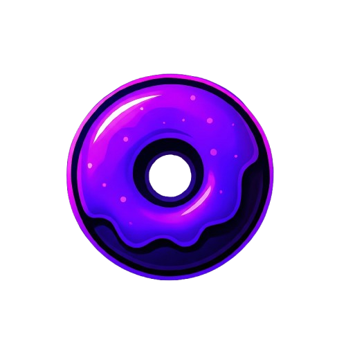

# 🍩 Glazed Client Website

The official, ultra-modern website for **Glazed Client** — the premier Meteor Client addon optimized for **DonutSMP**.

This repository houses the source code for the website, completely rewritten using **Astro** and **Tailwind CSS** to deliver a high-performance, visually stunning "Neon Cyberpunk" experience.



## ✨ Features

- **🎨 Neon Cyberpunk Theme**: A polished dark UI with glowing purple accents (`#9B3CFF`), glassmorphism, and animated elements.
- **⚡ High Performance**: Built with **Astro v5** for zero-javascript runtime by default (where possible) and blazing fast load times.
- **📂 Comprehensive Downloads**:
  - **Latest Version**: Quick access to the newest build (`v14`).
  - **Version Archive**: A dedicated timeline of all historical releases with changelogs and **SHA256** verification.
  - **Dependencies**: Direct links to Meteor Client, Fabric API, and Baritone.
- **🛡️ Module Status & Risk**: The **Features** page categorizes modules by risk level (🟢 Safe, 🟡 Use at Risk, 🔴 Highly Detectable) so users know exactly what they are getting into.
- **ℹ️ Informational Pages**:
  - **FAQ**: Expandable questions and answers.
  - **Credits**: A showcase of the Development Team and Staff.
  - **Legal**: Terms of Service and Privacy Policy.

## 🛠️ Tech Stack

- **Framework**: [Astro](https://astro.build/) (v5.0+)
- **Styling**: [Tailwind CSS](https://tailwindcss.com/) (v4.0+)
- **Language**: [TypeScript](https://www.typescriptlang.org/)
- **Icons**: SVG paths (Heroicons style) & Custom Assets

## 🚀 Getting Started

### Prerequisites

- **Node.js** (v18 or higher)
- **npm** (or pnpm/yarn)

### Installation

1.  **Clone the repository**:
    ```bash
    git clone https://github.com/realnnpg/glazedclientsite.git
    cd glazed-website
    ```

2.  **Install dependencies**:
    ```bash
    npm install
    ```

3.  **Run the development server**:
    ```bash
    npm run dev
    ```
    Access the site at `http://localhost:4321`.

### Build for Production

To generate the static files for deployment:

```bash
npm run build
```

The output will be in the `dist/` directory.

## 📁 Project Structure

```text
/
├── public/             # Static assets (logo.png, favicon.svg, user-placeholder.svg)
├── src/
│   ├── components/     # Reusable UI components (Navbar, Footer, Card, Button)
│   ├── layouts/        # Base page layouts (Layout.astro)
│   ├── pages/          # Route definitions
│   │   ├── index.astro     # Landing page
│   │   ├── downloads.astro # Latest download & guide
│   │   ├── archive.astro   # Version history
│   │   ├── features.astro  # Module list & risk status
│   │   ├── credits.astro   # Team & Staff
│   │   ├── faq.astro       # Frequently Asked Questions
│   │   ├── terms.astro     # Terms of Service
│   │   └── privacy.astro   # Privacy Policy
│   └── styles/         # Global styles & Tailwind theme
└── astro.config.mjs    # Astro configuration
```

## 👥 Credits

**Development Team:**
- **nnpj** - Owner, Client Developer
- **doshibadev** - Web Developer, Client Developer
- **dankor** - Web Developer
- **Potato** - Addon Developer
- **AR3 | Busy** - Client Developer
- **femboy** - Client Developer

**Staff & Support:**
- **skyler** - Admin
- **Ender** - Helper
- **cantzz** - Helper
- **Ziemniak** - Helper
- **mx** - Helper
- **aced** - Helper

## 📄 License & Disclaimer

**Glazed Client** is a third-party modification for Minecraft. It is not affiliated with, endorsed by, or associated with Mojang Studios or Microsoft Corporation.

Usage of this software on multiplayer servers may violate their terms of service. The developers of Glazed accept no responsibility for any bans or penalties incurred.

---
*Built with 💜 for the DonutSMP Hacking Community.*
